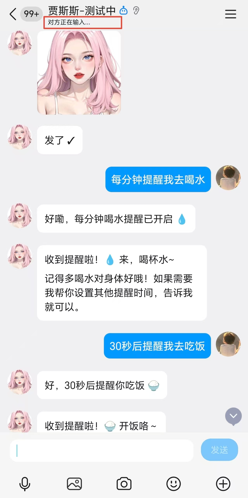
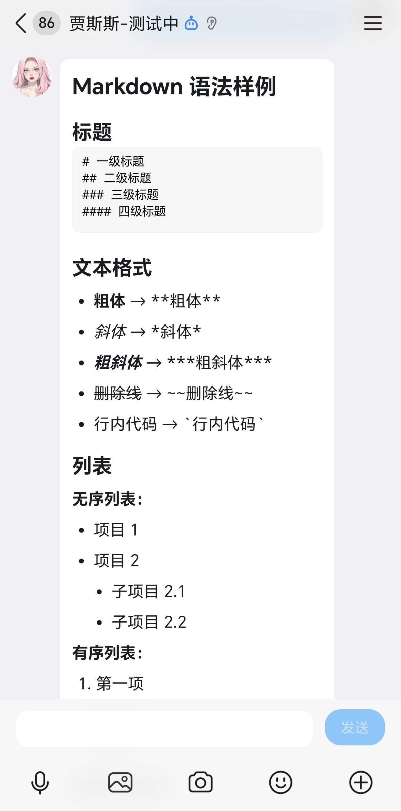
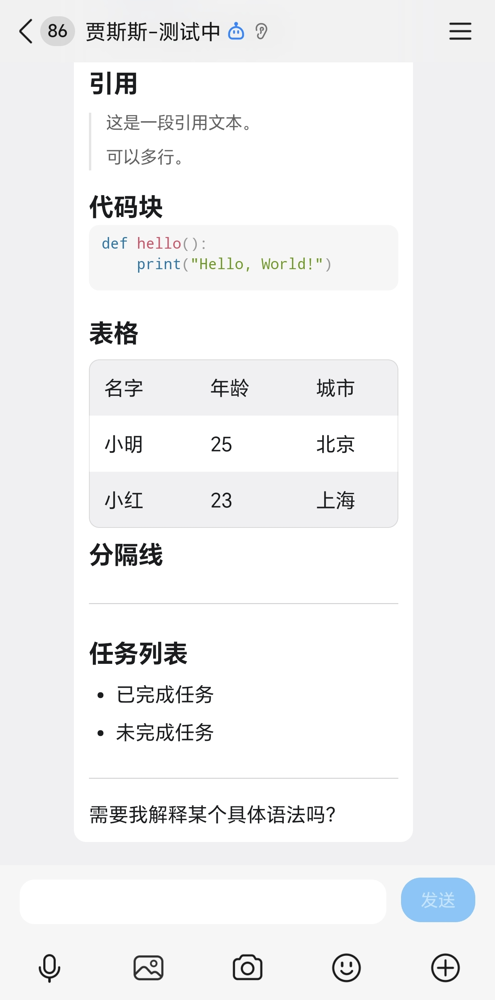
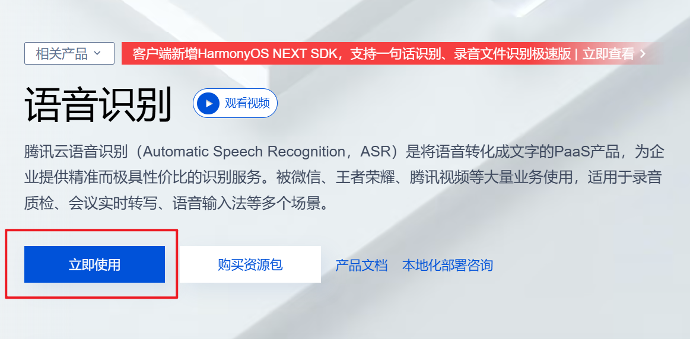
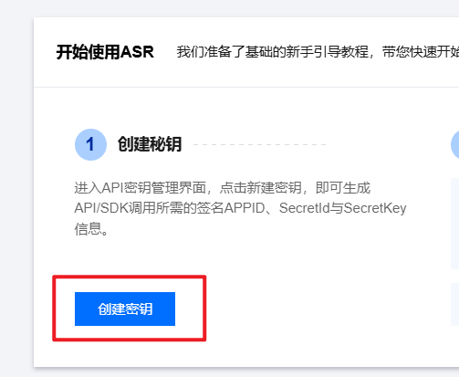
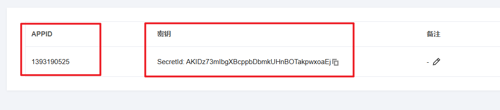
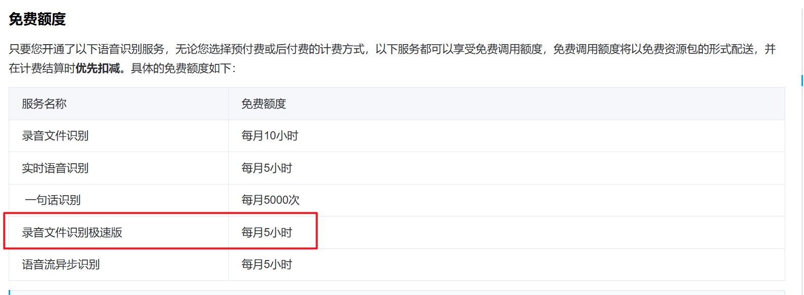

# QQ 渠道配置指南
<div align="center">

  <p>
    <strong>⭐ 如果这个项目对你有帮助，请给我们一个Star！⭐</strong><br>
    <em>您的支持是我们持续改进的动力</em>
  </p>
</div>

本文档用于 QQ 开放平台机器人在 OpenClaw China 中的部署与配置。

仓库地址：<https://github.com/BytePioneer-AI/openclaw-china>  

<p align="center">
  
  
  

</p>

## 一、获取 QQ 机器人凭证

### 1. 注册并登录 QQ 开放平台

访问 [QQ 开放平台](https://q.qq.com/#/register)，按提示完成注册并登录。

<p align="center"></p>

注册完成后进入控制台，按页面指引继续。

<p align="center"></p>
<p align="center"></p>

### 2. 创建机器人应用

进入 [应用管理](https://q.qq.com/#/apps)，选择“机器人”类型创建应用。

<p align="center"></p>

创建完成后点击进入应用详情页。

### 3. 获取 AppID / AppSecret

在应用详情页获取 `AppID` 与 `AppSecret`，用于配置 OpenClaw。

<p align="center"></p>

### 4. 开通权限与添加成员

<p align="center"></p>

可选：将机器人加入测试群，便于在 QQ 群中调试。

<p align="center"></p>

可选：QQ的MarkDown支持的很好，但需要申请，且有一定的申请时间。

```bash
# 申请成功后，可开通权限
openclaw config set channels.qqbot.markdownSupport true
```

<p align="center"></p>

供参考

<p align="center"></p>


---

## 二、安装 OpenClaw

### 1. 安装 OpenClaw

```bash
npm install -g openclaw@latest
```

### 2. 安装 OpenClaw China 全渠道插件（方式一：npm）

```bash
openclaw plugins install @openclaw-china/channels
```

### 3. 安装 OpenClaw China 全渠道插件（方式二：从源码安装，全平台通用）

⚠️ Windows 用户注意：由于 OpenClaw 存在 Windows 兼容性问题（spawn npm ENOENT），npm 安装方式暂不可用，请使用方式二。

```bash
git clone https://github.com/BytePioneer-AI/openclaw-china.git
cd openclaw-china
pnpm install
pnpm build
openclaw plugins install -l ./packages/channels
```

更新源码（用于后续升级）：

```bash
git pull origin main
pnpm install
pnpm build
```

---

## 三、配置与启动

### 1. 配置 QQ 渠道

```bash
openclaw config set channels.qqbot.enabled true
openclaw config set channels.qqbot.appId your-app-id
openclaw config set channels.qqbot.clientSecret your-app-secret
openclaw config set channels.qqbot.markdownSupport false


# 下面这些不需要配置，默认即可
openclaw config set channels.qqbot.dmPolicy open
openclaw config set channels.qqbot.groupPolicy open
openclaw config set channels.qqbot.requireMention true
openclaw config set channels.qqbot.textChunkLimit 1500
openclaw config set channels.qqbot.replyFinalOnly false
openclaw config set gateway.http.endpoints.chatCompletions.enabled true
```

### 2. 配置项说明

| 配置项 | 类型 | 默认值 | 说明 |
|--------|------|--------|------|
| enabled | boolean | true | 是否启用 QQ 渠道 |
| appId | string | - | QQ 机器人 AppID |
| clientSecret | string | - | QQ 机器人 AppSecret |
| markdownSupport | boolean | false | 是否使用 markdown 消息格式（需申请） |
| dmPolicy | string | "open" | 私聊策略：open/pairing/allowlist |
| groupPolicy | string | "open" | 群聊策略：open/allowlist/disabled |
| requireMention | boolean | true | 群聊是否必须 @ 机器人 |
| allowFrom | string[] | [] | 私聊白名单 |
| groupAllowFrom | string[] | [] | 群聊白名单 |
| textChunkLimit | number | 1500 | 文本分块长度 |
| replyFinalOnly | boolean | false | 是否仅发送最终回复 |

---

## 四、能力与限制

- 当前实现支持文本消息收发与图片发送（C2C/群聊）
- QQ C2C/群聊富媒体接口暂不支持通用文件（`file_type=4`，例如 PDF），这是官方接口限制而非插件缺陷，会降级为文本提示
- 频道内暂不支持媒体发送（会降级为文本 + URL）
- 不支持平台级流式输出
- 定时提醒通过 OpenClaw cron 触发（无需额外配置）

### 3. 启动服务

调试模式（建议先使用，便于查看日志）：

```bash
openclaw gateway --port 18789 --verbose
```

后台运行：

```bash
openclaw daemon start
```

---

## 五、可选操作：开启语音转文本

如果你希望 QQ 语音消息可以自动转文字后再交给 Agent 处理，可按下面步骤配置腾讯云 ASR（录音文件识别极速版）。

### 1. 开通 ASR 服务

访问腾讯云语音识别产品页并点击“立即使用”：  
https://cloud.tencent.com/product/asr

说明：腾讯云 ASR 提供每月免费额度（以腾讯云控制台最新计费规则为准），额度如下：
- 录音文件识别极速版（`asr/flash/v1`）：5 小时/月



### 2. 创建 API 密钥

进入腾讯云控制台语音识别页（或对应 API 密钥管理页）创建密钥，获取：
- `appId`
- `secretId`
- `secretKey`

控制台入口：  
https://console.cloud.tencent.com/asr





### 3. 在 OpenClaw 中配置

```bash
openclaw config set channels.qqbot.asr.enabled true
openclaw config set channels.qqbot.asr.appId your-tencent-app-id
openclaw config set channels.qqbot.asr.secretId your-tencent-secret-id
openclaw config set channels.qqbot.asr.secretKey your-tencent-secret-key
```


### 4. 计费文档

请仔细查看腾讯云计费文档。

https://cloud.tencent.com/document/product/1093/35686?from=console_document_search#58abe873-a924-4b4d-b056-59510b66c4d3


